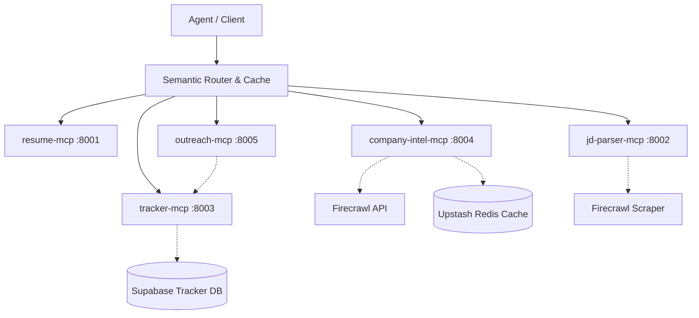

# NeuroHire — Multi-Server MCP Architecture

NeuroHire is an autonomous job application helper powered by five Model Context Protocol (MCP) servers and a shared resiliency/intelligence layer. It parses job descriptions, scrapes company intelligence, matches candidate skills, generates tailored resumes/emails, and tracks pipeline status in a database.



---

## 🌐 Server Port Allocation

| Component | Port | Folder Location | Purpose |
| :--- | :---: | :--- | :--- |
| **resume-mcp** | `8001` | [resume_mcp](file:///c:/Users/ASUS/OneDrive/Desktop/123/Hirepros/neurohire/mcp_servers/resume_mcp) | Manages candidate credentials, history, and achievements. |
| **jd-parser-mcp** | `8002` | [jd_parser_mcp](file:///c:/Users/ASUS/OneDrive/Desktop/123/Hirepros/neurohire/mcp_servers/jd_parser_mcp) | Scrapes and parses Job Descriptions into structured signals. |
| **tracker-mcp** | `8003` | [tracker_mcp](file:///c:/Users/ASUS/OneDrive/Desktop/123/Hirepros/neurohire/mcp_servers/tracker_mcp) | Database CRUD operations for job applications, events, and drafts. |
| **company-intel-mcp** | `8004` | [company_intel_mcp](file:///c:/Users/ASUS/OneDrive/Desktop/123/Hirepros/neurohire/mcp_servers/company_intel_mcp) | Deep search on target company funding, tech stack, and reviews. |
| **outreach-mcp** | `8005` | [outreach_mcp](file:///c:/Users/ASUS/OneDrive/Desktop/123/Hirepros/neurohire/mcp_servers/outreach_mcp) | Dynamic email/message copy generator under strict length constraints. |

---

## ⚙️ Environment Configuration

Copy `.env.example` at `neurohire/` to `.env`. The project defaults to `MOCK_MODE=true` allowing 100% functionality and test pass rate with no external keys.

```ini
MOCK_MODE=true

# API Keys (Needed for production mode / MOCK_MODE=false)
GITHUB_TOKEN=your_github_token_here
FIRECRAWL_API_KEY=your_firecrawl_api_key_here
SUPABASE_URL=your_supabase_url_here
SUPABASE_KEY=your_supabase_key_here
UPSTASH_REDIS_URL=your_redis_connection_url_here
```

---

## 🚀 Getting Started

### 1. Setup Virtual Environment
Run the following inside the `neurohire` folder:
```powershell
# Windows
cd neurohire
python -m venv venv
.\venv\Scripts\Activate.ps1
pip install -r mcp_servers/shared/requirements.txt
```

### 2. Managing Servers Locally

To start or stop all five servers in background mock mode:

**On Windows (PowerShell):**
```powershell
# Start all 5 servers
.\run_all_mock.ps1 start

# Stop all 5 servers
.\run_all_mock.ps1 stop
```

**On Unix / Git Bash:**
```bash
# Start all 5 servers
./run_all_mock.sh start

# Stop all 5 servers
./run_all_mock.sh stop
```

---

## 🧪 Verification & E2E Tests

### Shared Layer Unit Tests
Verifies error taxonomies, retry mechanism, backoffs, and routing fallback.
```bash
cd neurohire
.\venv\Scripts\python.exe -m pytest mcp_servers/shared/test_self_healing.py
.\venv\Scripts\python.exe -m pytest mcp_servers/shared/test_routing.py
```

### End-to-End Integration Suite
Performs a sequential pipeline test (7/7 steps) launching and tearing down all servers programmatically:
```bash
cd neurohire
.\venv\Scripts\python.exe test_integration_e2e.py
```

---

## 📁 Individual Documentation

For deeper tool specifications, code structures, and schemas, visit the sub-readmes:
- [Shared Resiliency README](file:///c:/Users/ASUS/OneDrive/Desktop/123/Hirepros/neurohire/mcp_servers/shared/README.md)
- [Resume MCP README](file:///c:/Users/ASUS/OneDrive/Desktop/123/Hirepros/neurohire/mcp_servers/resume_mcp/README.md)
- [JD Parser MCP README](file:///c:/Users/ASUS/OneDrive/Desktop/123/Hirepros/neurohire/mcp_servers/jd_parser_mcp/README.md)
- [Tracker MCP README](file:///c:/Users/ASUS/OneDrive/Desktop/123/Hirepros/neurohire/mcp_servers/tracker_mcp/README.md)
- [Company Intel MCP README](file:///c:/Users/ASUS/OneDrive/Desktop/123/Hirepros/neurohire/mcp_servers/company_intel_mcp/README.md)
- [Outreach MCP README](file:///c:/Users/ASUS/OneDrive/Desktop/123/Hirepros/neurohire/mcp_servers/outreach_mcp/README.md)
